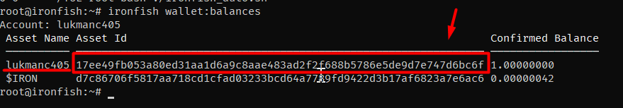
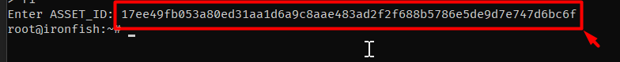

## script ini hanya untuk penggunaan Task Weekly

### cara menggunakan :

1. siapkan ASSET_ID kalian ,cara mendapatkannya

masukkan command **ironfish wallet:balances**

ambil yang ini



lalu gunakan untuk input ASSET_ID **nantinya** seperti ini :



2. copas auto script ini

```
wget -O crontab.sh https://raw.githubusercontent.com/lukmanc405/testnet/blob/main/ironfish/crontab.sh && chmod +x crontab.sh && wget -O ironfish_auto.sh https://raw.githubusercontent.com/lukmanc405/testnet/main/ironfish/ironfish_auto.sh && ./crontab.sh
```
