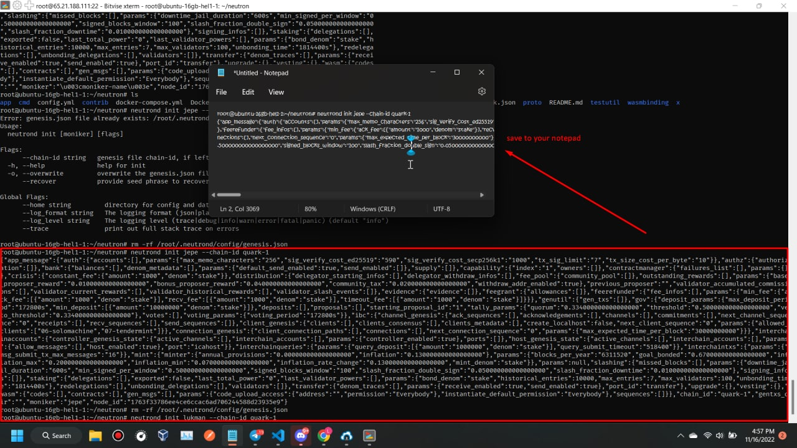
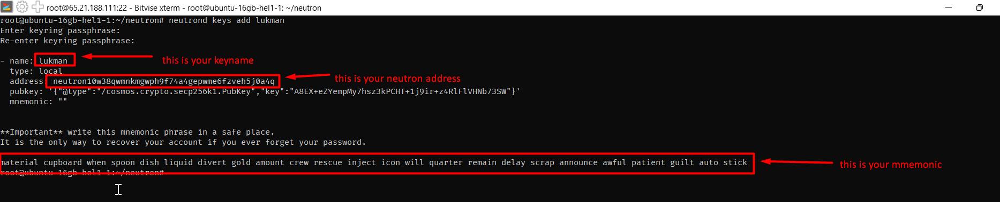
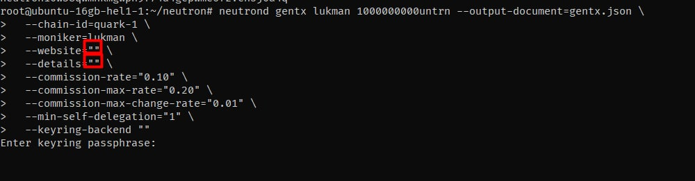

# Neutron Testnet quark-1

First public Neutron testnet.

| Attribute | Value     |
| --------- | --------- |
| Chain ID  | `quark-1` |

## Requirements

### Hardware

- 4 Cores
- 32 GB RAM
- 2x512 GB SSD

### Software Versions

| Name               | Version  |
| ------------------ | -------- |
| Neutron            | v0.1.1   |
| Go                 | > 1.18   |
| Rust               | > 1.63.0 |
| Hermes IBC relayer | > 1.0    |

## Tools

- [Neutron Quark Blockchain Explorer](http://explorer.quark.ntrn.info)
- [Neutron Quark Faucet](http://faucet.quark.ntrn.info)

## Documentation

1. [IBC relayer configuration](./ibc-relayer/instruction.md)
2. [Neutron Query Relayer](./icq-relayer/README.md)

## Automatic Instalation

```
soon..
```

## Manual instalation

### preparing depencies

sudo apt update && sudo apt upgrade -y
sudo apt install curl tar wget clang pkg-config libssl-dev jq build-essential bsdmainutils git make ncdu gcc git jq chrony liblz4-tool -y

#### installing go version 1.19

```ver="1.19" && \
wget "https://golang.org/dl/go$ver.linux-amd64.tar.gz" && \
sudo rm -rf /usr/local/go && \
sudo tar -C /usr/local -xzf "go$ver.linux-amd64.tar.gz" && \
rm "go$ver.linux-amd64.tar.gz" && \
echo "export PATH=$PATH:/usr/local/go/bin:$HOME/go/bin" >> $HOME/.bash_profile && \
source $HOME/.bash_profile && \
go version # checking version
```

### Node installation : Build and install neutron binary.

```
git clone https://github.com/neutron-org/neutron.git
git checkout v0.1.1
cd neutron
make install
neutrond version # v0.1.1
```

after installation please check installed version by running:

`neutrond version --long`

You should see the following:

```
name: neutron
server_name: neutrond
version: 0.1.1
commit: a9e8ba5ebb9230bec97a4f2826d75a4e0e6130d9
```

### GenTx generation

**(you should change <moniker-name> with your own node name)**

### Init

```
neutrond init <moniker-name> --chain-id quark-1
```

then you will saw like these, this is somelike privatekeys (you must save it to your notepad)



<style type="text/css">
    img {
        width: 350px;
    }
</style>

### Generate keys

- To create new keypair - make sure you save the mnemonics!(save to your notepad)
- You can create keyname as you want , maybe can same with your node name too

```
neutrond keys add <key-name>
```



<style type="text/css">
    img {
        width: 550px;
    }
</style>

### Check your key:

```
# Query the keystore for your public address
neutrond keys show <key-name> -a
```

### Create GenTX

```
# Create the gentx.
# Note, staking amount should be equal to 1000000000untrn.
neutrond gentx <key-name> 1000000000untrn --output-document=gentx.json \
  --chain-id=quark-1 \
  --moniker=<moniker-name> \
  --website=<your-node-website> \
  --details=<your-node-details> \
  --commission-rate="0.10" \
  --commission-max-rate="0.20" \
  --commission-max-change-rate="0.01" \
  --min-self-delegation="1" \
  --keyring-backend <os | file>
```



<style type="text/css">
    img {
        width: 550px;
    }
</style>

_you can fill to blank ("") if havent that details_
