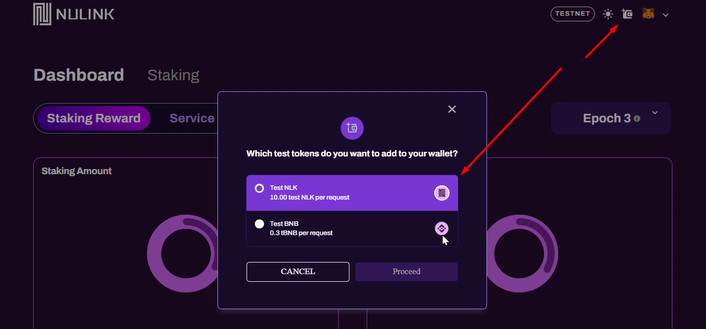
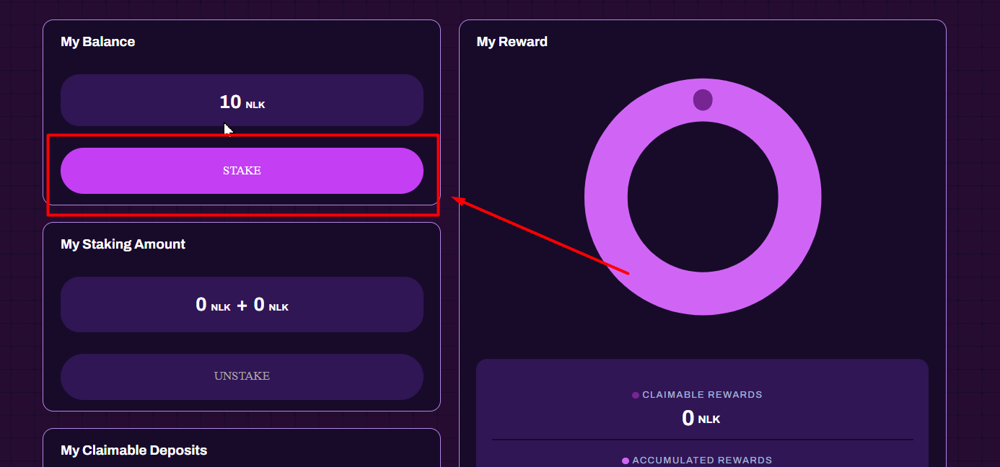
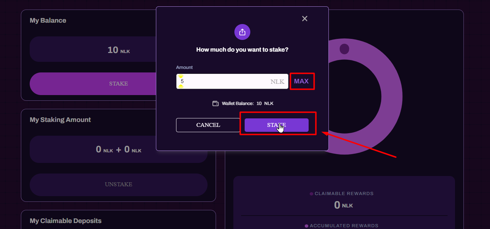
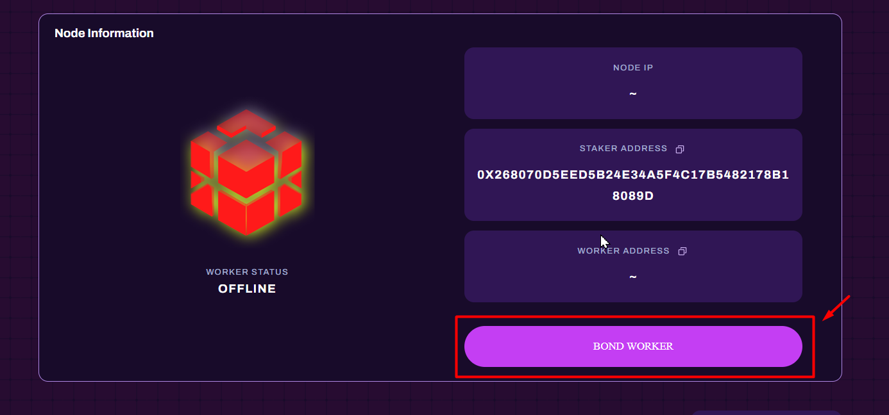
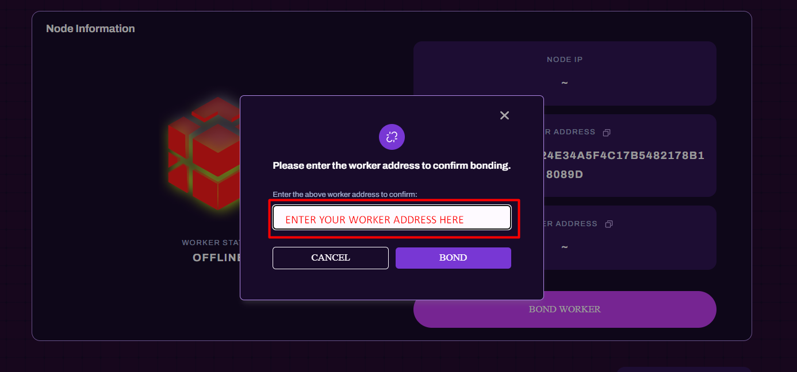
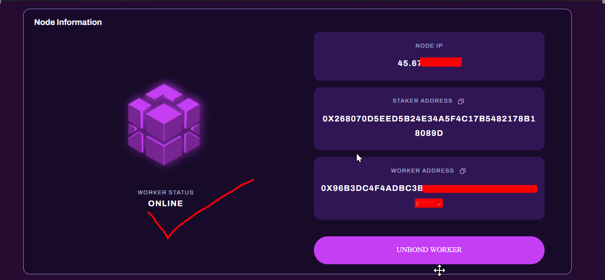

<p align="right">
<html>
   <body>
      <a href="https://t.me/detective_gems/">
         Join Channel Detective Gems
      </a>
   </body>
</html>
</p>
          
<p align="center">
 
<p>

# NuLink Testnet `Horus 2.0`
---

- Date: Phase 1: Starting December 31, 2023 at 18:00 (UTC+7)
- Official Instructions: https://docs.nulink.org/products/testnet
- More info about testnet: https://www.nulink.org/blog-posts/announcement-for-nulink-testnet-horus-2-0

#### Official documentation:
----
- Official manual: https://docs.nulink.org/products/testnet#get-started
- Block explorer: N/A

#### Recommended hardware requirements
| Hardware | Specs    |
| :---:   | :---: |
| RAM | 4GB RAM |
| DISK | 30 GB SSD STORAGE |
| OS | Ubuntu 20.04 LTS|

#### Required ports :
- Exposed  TCP port `9151` , make sure it's not occupied
open port `9151`
```
apt install ufw -y 
ufw allow ssh 
ufw allow https 
ufw allow http 
ufw allow 9151
ufw enable
```

#### 1. Create a worker account (automatic instalation)
```
wget -O nulink.sh https://raw.githubusercontent.com/lukmanc405/testnet/main/nulink/nulink.sh && chmod +x nulink.sh && ./nulink.sh
```

- at last creating worker you need to create password then repeat that
  


- save these information to your pc/notepad


#### 2. Send `TBNB` to your operator address above 

- get faucet from https://testnet.binance.org/faucet-smart


- send funds to your operator address 


#### 3. NuLink Worker Installation

- Copy the keystore file of the Worker account to the host directory selected in step 1. The private file generated by NuLink Worker will also be stored in this directory. Please ensure that this directory has 777 permissions, if not yet just type `chmod -R 777 /root/nulink`

- then type this 
`cp xxxxxxxx /root/nulink`

- Replace `xxxxxxx` by your Path of the `secret key file`


- example it will be like this 


### set vars
- NOTE : CHANGE `$YOUR_PASSWORD` to your own password

```
export NULINK_KEYSTORE_PASSWORD=$YOUR_PASSWORD
```
```
export NULINK_OPERATOR_ETH_PASSWORD=$YOUR_PASSWORD
```

like this example :


#### 4. set docker config
NOTE : 
- CHANGE `$ETH_KEYSTORE_URL` with your UTC--2022-09-21T11-15-34.119242544Z--7c14dhsdjhhdksahfsnjdjid (you created above in step 1)
- CHANGE `$OPERATOR_ADDRESS` with your operator addres (you created above in step 1)

*Reminder this will create pharse , you need to save that!*

```
chmod -R 777 /root/nulink

docker run -it --rm \
-p 9151:9151 \
-v /root/nulink:/code \
-v /root/nulink:/home/circleci/.local/share/nulink \
-e NULINK_KEYSTORE_PASSWORD \
nulink/nulink nulink ursula init \
--signer keystore:///code/$ETH_KEYSTORE_URL \
--eth-provider https://data-seed-prebsc-2-s2.binance.org:8545 \
--network horus \
--payment-provider https://data-seed-prebsc-2-s2.binance.org:8545 \
--payment-network bsc_testnet \
--operator-address $OPERATOR_ADDRESS \
--max-gas-price 10000000000

```
like this example :


you will see like this ,copy and save to your notepad


after then enter previously blue words

then showing like this ,save this info to yor notepad


#### 5. Start the node
```
docker run --restart on-failure -d \
--name ursula \
-p 9151:9151 \
-v /root/nulink:/code \
-v /root/nulink:/home/circleci/.local/share/nulink \
-e NULINK_KEYSTORE_PASSWORD \
-e NULINK_OPERATOR_ETH_PASSWORD \
nulink/nulink nulink ursula run --no-block-until-ready
```

#### check node logs

```
docker logs -f ursula
```

### update node

```
wget -O update_node.sh https://raw.githubusercontent.com/lukmanc405/testnet/main/nulink/update_node.sh && chmod +x update_node.sh && ./update_node.sh
```


#### make sure your note pad have these backup


   
### Staking & Bond an active worker to gain reward
---

1. Go to [NLK faucet](https://dashboard.testnet.nulink.org/)



2. Now go to [horus staking](https://dashboard.testnet.nulink.org/) 


3. Press max then confirm 



4. Now bond worker



5. put worker address






#### Congrats well done,you finish it!

### Dont forget to fill the [form](https://docs.google.com/forms/d/e/1FAIpQLSdY2eXwQD-tKvJ_Ug-6hgdcWK_wUOZjXeJknw5XWSEO8gzJ2w/viewform)

Form Submission:

- After completing the 7 epochs with a living ratio above 80%, participants must fill out the provided form.

- Participants who do not fill out the form will not be eligible for the raffle draw.

#### other command for worker nodes (if needed)
   
to delete node

```
cd $HOME && docker stop ursula && docker rm ursula && rm -rf ~/{geth-linux-amd64-1.10.23-d901d853,geth-linux-amd64-1.10.23-d901d853.tar.gz,nulink,nulink.sh}
```
