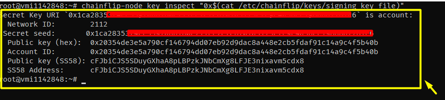

# Chainflip

#### Introduction Chainflip


Chainflip is a decentralised, trustless protocol that enables cross chain swaps between different blockchains.

Chainflip is what everybody wanted but wasn’t yet possible: easy and intuitive swaps from one major blockchain to another. Chainflip will connect and bridge major ecosystems like Bitcoin, Ethereum, Polkadot, Solana or Cosmos to allow users to navigate through this growing multi-chain space.

#### Official Channels

* Discord - https://discord.gg/8zbsqDsfyp
* Twitter - https://twitter.com/chainflip
* Telegram - https://t.me/chainflip\_io\_chat
* Official Guide - https://docs.chainflip.io/perseverance-validator-documentation/

**Recommended hardware requirements**

***

| Hardware |       Specs       |
| :------: | :---------------: |
|    CPU   |       4 CPU       |
|    RAM   |      8GB RAM      |
|   DISK   | 400GB SSD STORAGE |
|    OS    |  Ubuntu 20.04 LTS |
|  NETWORK |       20mbps      |

**Persiapan dan modal**

Modal : VPS/VDS , Wallet Metamask , API Alchemy ,& tFLIP

1. Order VPS contabo 


Pilih docker dengan ubuntu 20.04 dan pilih storage 400GB


Generate password lalu pilih Next


Terakhir Klik Order + Pay , lakukan pembayaran dengan paypal atau credit card sesuai dengan yang anda gunakan pada payment method


Selanjutnya anda akan mendapatkan detail seperti ini di EMAIL anda , yang berisi detail IP dan password


2. Konek VPS

Via Bitvise Koneksikan IP & Password sesuai dengan email, jangan ubah apapun selain itu


lalu pencet Login


dan klik New Terminal


Jika tampilan seperti ini berarti anda sudah login


3. Buat akun Alchemy 


Lalu pilih create app


Kembali ke dasboard lalu klik VIEW KEY


Kemudian copy HTTPS & WEBSOCKET kita akan membutuhkannya nanti


4. Siapkan Goerli ETH Testnet pada Metamask anda

Faucet disini : https://goerlifaucet.com/

> Penting anda harus melakukan ini sebelum lanjut step berikutnya, pastikan sudah ada ETH Goerli di akun anda

### Set Up validator

Anda harus buka terminal Bitvise tadi lalu lakukan sesuai intruksi dibawah ini

1.  Update pkg

    ```
    sudo apt update && sudo apt upgrade -y
    ```
2.  Buka ports

    ```
    apt install ufw -y
    ufw allow ssh
    ufw allow https
    ufw allow http
    ufw allow 30333
    ufw allow 8078
    ufw enable
    ```

    Kemudian klik y dan Enter

    
3.  Download binaries

    ```
    sudo mkdir -p /etc/apt/keyrings
    curl -fsSL repo.chainflip.io/keys/gpg | sudo gpg --dearmor -o /etc/apt/keyrings/chainflip.gpg
    ```
4.  Verify the key’s authenticity:

    ```
    gpg --show-keys /etc/apt/keyrings/chainflip.gpg
    ```
5.  Tambahkan Chainflip’s Repo ke `apt sources list`:

    ```
    echo "deb [signed-by=/etc/apt/keyrings/chainflip.gpg] https://repo.chainflip.io/perseverance/ focal main" | sudo tee /etc/apt/sources.list.d/chainflip.list
    ```
6.  Install chainflip cli

    ```
    sudo apt-get update
    sudo apt-get install -y chainflip-cli chainflip-node chainflip-engine
    ```

    Setelah itu klik enter
7.  Generating Keys

    ```
    sudo mkdir /etc/chainflip/keys
    ```

    Kemudian anda harus menyimpan private key dari metamask anda dengan command berikut ini

    ```
    echo -n "XXX" |  sudo tee /etc/chainflip/keys/ethereum_key_file
    ```

    

    Anda harus mengganti `XXX` dengan private key dari metamask anda misalnya seperti ini

    ```
    echo -n "df89823d7705945c837011d288d09c6a549a471922d73f2fe1fc3cb66abe2772" |  sudo tee /etc/chainflip/keys/ethereum_key_file
    ```

    

    jangan lupa klik enter agar kembali ke root
8.  Generating signig keys

    ```
    chainflip-node key generate
    ```

    

    simpan ke notepad

    

8.1 Buat variable dengan nama `SECRET_SEED`

```
SECRET_SEED=XXX
```

Ubah XXX dengan ini


Misal seperti ini

```
SECRET_SEED=0x1ca28353f4cc5397a6b1b0c211cc2efeb701a3173efc9c4a56ec19866d7281b1
```

Setelah itu masukkan command ini :

```
echo -n "${SECRET_SEED:2}" | sudo tee /etc/chainflip/keys/signing_key_file
```


kemudian enter

dan kita lakukan sekali lagi untuk komunkasi antar validator

```
sudo chainflip-node key generate-node-key --file /etc/chainflip/keys/node_key_file
```


Masukkan perintah dibawah ini agar hanya pengguna saat ini yang dapat membaca file, dan private key tidak tersedia di riwayat shell Anda:

```
sudo chmod 600 /etc/chainflip/keys/ethereum_key_file
sudo chmod 600 /etc/chainflip/keys/signing_key_file
sudo chmod 600 /etc/chainflip/keys/node_key_file
history -c
```

9. Konfigurasi file

buat konfigurasi file seperti berikut masukkan dulu command ini :

```
sudo mkdir -p /etc/chainflip/config
sudo nano /etc/chainflip/config/Default.toml
```

setelah itu anda akan masuk new window

dan masukkan data berikut

```
# Default configurations for the CFE
[node_p2p]
node_key_file = "/etc/chainflip/keys/node_key_file"
ip_address="XXX"
port = "8078"

[state_chain]
ws_endpoint = "ws://127.0.0.1:9944"
signing_key_file = "/etc/chainflip/keys/signing_key_file"

[eth]
# Ethereum RPC endpoints (websocket and http for redundancy).
ws_node_endpoint = "YYY"
http_node_endpoint = "ZZZ"

# Ethereum private key file path. This file should contain a hex-encoded private key.
private_key_file = "/etc/chainflip/keys/ethereum_key_file"

[signing]
db_file = "/etc/chainflip/data.db"
```

* ubah XXX dengan alamat IP VPS
* ubah YYY dengan websocket alchemy
* ubah ZZZ dengan Https alchemy


selanjutnya pencet shortcut CRTL + X lalu pencet Y dan Enter untuk menyimpan konfigurasi

10. Mulai menjalankan 10.1 Jalankan chainflip node

```
sudo systemctl start chainflip-node
```

untuk mengetahui status sudah jalan bisa menggunakan perintah berikut :

```
sudo systemctl status chainflip-node
```


untuk keluar mode status klik CTRL+C

untuk pengecekan logs bisa menggunakan

```
tail -f /var/log/chainflip-node.log
```

untuk keluar mode cek logs klik CTRL+C

10.2 untuk mulai menjalankan `chainflip-engine` kita akan gunakan command lain

```
sudo systemctl start chainflip-engine
```

untuk pengecekan service gunakan

```
sudo systemctl status chainflip-engine
```


dan pada akhirnya keduanya (chainflip engine & chainflip node) berjalan

lakukan ini agar keduanya berjalan setelah reboot

```
sudo systemctl enable chainflip-node && sudo systemctl enable chainflip-engine
```

cek engine logs

```
tail -f /var/log/chainflip-engine.log
```


lalu klik CTRL+C

11. Buat konfigurasi file untuk `logrotate`

masukkan command ini :

```
sudo tee /etc/logrotate.d/chainflip > /dev/null << EOF
/var/log/chainflip-*.log {
  rotate 7
  daily
  dateext
  dateformat -%Y-%m-%d
  missingok
  notifempty
  copytruncate
  nocompress
}
EOF
```

Kemudian berikan command ini agar root mendapat user ownership

```
sudo chmod 644 /etc/logrotate.d/chainflip
sudo chown root.root /etc/logrotate.d/chainflip
```

12. Bidding dan staking

* Kunjungi https://stake-perseverance.chainflip.io/auctions

 

ambil validator public key dari notepad anda (SS58)


Kemudian klik approve dan confirm metamask 

Lalu klik Stake 

Setelah sukses staking anda perlu kembali ke terminal dan masukkan ini

```
sudo systemctl restart chainflip-engine.service && sudo systemctl restart chainflip-node.service
```

> Tunggu 4-5 jam sampai node anda idle baru lanjut step selanjutnya , jika tidak akan terus bertuliskan is not staked


1. Registering Validator Keys:

Setelah node anda muncul di Aplikasi Staking, Anda perlu mengatur kunci yang akan digunakan Validator Anda untuk menghasilkan blok. Jika Anda tidak melakukannya, Validator Anda tidak dapat dipilih untuk memenangkan Lelang. Untuk mengatur kunci, Anda dapat menggunakan `chainflip-cli`.

Pertama-tama anda harus mendaftarkan node anda sebagai validator dengan command berikut ini

```
sudo chainflip-cli \
      --config-path /etc/chainflip/config/Default.toml \
      register-account-role Validator
```

akan muncul seperti ini


pencet Y kemudian Enter

selamat anda telah berhasil menghidupkan node anda, anda bisa mengeceknya 

[disini](../chainflip/images/Screenshot\_37.png)

Kemudian, aktifkan akun Anda agar dapat diikutsertakan dalam Auction berikutnya. Perintah berikut akan mengirimkan aktivasi:

```
sudo chainflip-cli \
    --config-path /etc/chainflip/config/Default.toml rotate
```


Secara opsional, Anda dapat mengatur Vanity Name untuk validator anda dengan menjalankan:

```
sudo chainflip-cli \
    --config-path /etc/chainflip/config/Default.toml \
    vanity-name XXX
```

Ubah XXX menjadi nama discord anda seperti ini :

```
sudo chainflip-cli \
    --config-path /etc/chainflip/config/Default.toml \
    vanity-name lukman#3969
```


lalu anda bisa mengecek hasilnya disini 

Poin penting lainnya: Jangan lupa untuk mendapatkan role partisipan testnet di Discord di bagian #join-testnet


#### Advanced guide :

a. cara export key (simpan key, bisa berguna jika pindah VPS atau mau jeda sementara)

masukkan command ini

```
chainflip-node key inspect "0x$(cat /etc/chainflip/keys/signing_key_file)"
```



simpan pada **NOTEPAD**

b. command shutdown node

```
systemctl stop chainflip-node.service && systemctl stop chainflip-engine.service
systemctl disable chainflip-node.service && systemctl disable chainflip-engine.service
rm /etc/systemd/system/chainflip-node.service && rm /etc/systemd/system/chainflip-engine.service
rm /etc/systemd/system/chainflip-node.service && rm /etc/systemd/system/chainflip-engine.service
rm /usr/lib/systemd/system/chainflip-node.service && rm /usr/lib/systemd/system/chainflip-node.service
systemctl daemon-reload
systemctl reset-failed
```

c. cara import old key ke VPS baru

* kunjungi situs ini untuk panduan migrasi https://docs.chainflip.io/perseverance-validator-documentation/maintenance/migrating-to-a-different-server

\======================================SELESAI======================================

Jangan lupa join channel kami : https://t.me/detective\_gems
