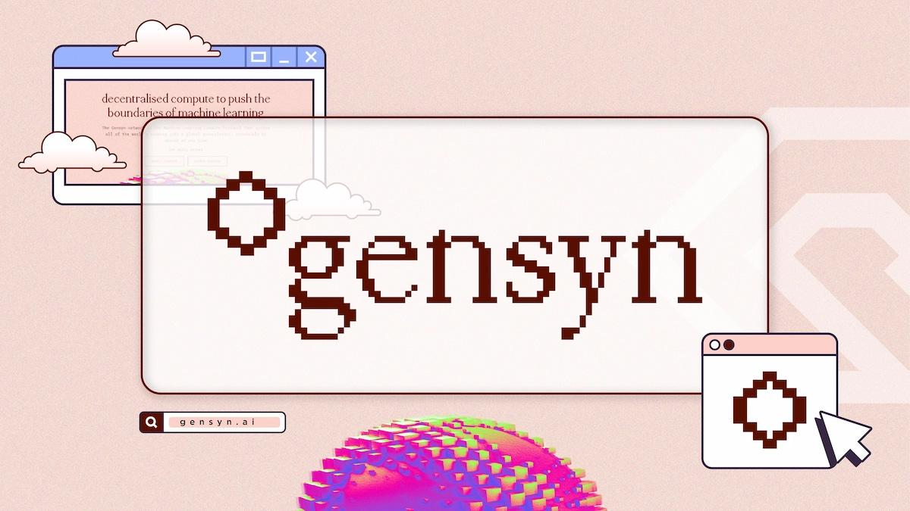

# Gensyn-ai

<figure><figcaption></figcaption></figure>

* CPU: Minimum 16GB RAM (more RAM recommended for larger models or datasets).

OR

*   GPU (Optional): Supported CUDA devices for enhanced performance:

    * RTX 3090
    * RTX 4090
    * A100
    * H100

    > recommend GPUs with >=24GB vRAM.
* **Note**: You can run the node without a GPU using CPU-only mode.

### 1) Install Dependencies


**1. Update System Packages**

```
sudo apt-get update && sudo apt-get upgrade -y
```

**2. Install General Utilities and Tools**

```
sudo apt install screen curl iptables build-essential git wget lz4 jq make gcc nano automake autoconf tmux htop nvme-cli libgbm1 pkg-config libssl-dev libleveldb-dev tar clang bsdmainutils ncdu unzip libleveldb-dev  -y
```

**3. Install Python**

```
sudo apt-get install python3 python3-pip python3-venv python3-dev -y
```

**4. Install Node**

```
sudo apt-get update
```

```
curl -fsSL https://deb.nodesource.com/setup_22.x | sudo -E bash -
```

```
sudo apt-get install -y nodejs
```

```
node -v
```

```
sudo npm install -g yarn
```

```
yarn -v
```

**5. Install Yarn**

```
curl -o- -L https://yarnpkg.com/install.sh | bash
```

```
export PATH="$HOME/.yarn/bin:$HOME/.config/yarn/global/node_modules/.bin:$PATH"
```

```
source ~/.bashrc
```

***

### 2) Get HuggingFace Access token


**1- Create account in** [**HuggingFace**](https://huggingface.co/)

**2- Create an Access Token with `Write` permissions** [**here**](https://huggingface.co/settings/tokens) **and save it**

***

### 3) Clone the Repository


```
git clone https://github.com/gensyn-ai/rl-swarm/
cd rl-swarm
```

***

### 4) Run the swarm


Open a screen to run it in background

```
screen -S swarm
```

Install swarm

```
python3 -m venv .venv
source .venv/bin/activate
./run_rl_swarm.sh
```

Press `Y`

***

### 5) Login


**1- You have to receive `Waiting for userData.json to be created...` in logs**

[](https://github.com/user-attachments/assets/140f7d32-844f-4cf0-aac4-a91e9a14c1aa)

**2- Open login page in browser**

* **Local PC:** `http://localhost:3000/`
* **VPS users:** Do not receive OTP code in emails by logging in 3000 port on browser. You have to forward port by entering a command in their local pc powershell command prompt. (Step 3 of this section)

**3- ⚠️ If you can't login or no email code received, Forward port:**

* In windows start menu, Search **Powershell** and open its terminal in your local PC
* Enter the command below and replace your vps ip with `Server_IP` and your vps port(.eg 22) with `SSH_PORT`

```
ssh -L 3000:localhost:3000 root@Server_IP -p SSH_PORT
```

* ⚠️ Make sure you enter the command in your own local Windows Powershell cmd and NOT your VPS terminal.
* This prompts you to enter your VPS password, when you enter it, you connect and tunnel to your vps
* Now go to browser and open `http://localhost:3000/` and login

**4- Login with your preferred method**

[](https://github.com/user-attachments/assets/f33ea530-b15f-4af7-a317-93acd8618a9f)

* After login, your terminal starts installation.

**5- Optional: Push models to huggingface**

* Enter your `HuggingFace` access token you've created when it prompted
* This will need `2GB` upload bandwidth for each model you train, you can pass it by entering `N`

[](https://github.com/user-attachments/assets/11c3a798-49c2-4a87-9e0b-359f3378c9e2)

***

#### Node Name


* Now your node started running, Find your name after word `Hello`, like mine is `whistling hulking armadillo` as in the image below (You can use `CTRL+SHIFT+F` to search Hello in terminal)

[](https://github.com/user-attachments/assets/a1abdb1a-aa11-407f-8e5b-abe7d0a6b0f3)

***

#### Screen commands


* Minimize: `CTRL` + `A` + `D`
* Return: `screen -r swarm`
* Stop and Kill: `screen -XS swarm quit`

***

### Backup


**You need to backup `swarm.pem`**.

#### `VPS`:


Connect your VPS using `Mobaxterm` client to be able to move files to your local system. Back up these files:\*\*

* `/root/rl-swarm/swarm.pem`

#### `WSL`:


Search `\\wsl.localhost` in your _**Windows Explorer**_ to see your Ubuntu directory. Your main directories are as follows:

* If installed via a username: `\\wsl.localhost\Ubuntu\home\<your_username>`
* If installed via root: `\\wsl.localhost\Ubuntu\root`
* Look for `rl-swarm/swarm.pem`

#### `GPU servers (.eg, Hyperbolic)`:


**1- Connect to your GPU server by entering this command in `Windows PowerShell` terminal**

```
sftp -P PORT ubuntu@xxxx.hyperbolic.xyz
```

* Replace `ubuntu@xxxx.hyperbolic.xyz` with your given GPU hostname
* Replace `PORT` with your server port (in your server ssh connection command)
* `ubuntu` is the user of my hyperbolic gpu, it can be _**anything else**_ or it's `root` if you test it out for `vps`

Once connected, you’ll see the SFTP prompt:

```
sftp>
```

**2- Navigate to the Directory Containing the Files**

* After connecting, you’ll start in your home directory on the server. Use the `cd` command to move to the directory of your files:

```
cd /home/ubuntu/rl-swarm
```

**3- Download Files**

* Use the `get` command to download the files to your `local system`. They’ll save to your current local directory unless you specify otherwise:

```
get swarm.pem
```

* Downloaded file is in the main directory of your `Powershell` or `WSL` where you entered the sFTP command.
  * If entered sftp command in `Porwershell`, the `swarm.pem` file might be in `C:\Users\<pc-username>`.
* You can now type `exit` to close connection. The files are in the main directory of your `Powershell` or `WSL` where you entered the first SFTP command.

***

#### Recovering Backup file (upload)


If you need to upload files from your `local machine` to the `server`.

* `WSL` & `VPS`: Drag & Drop option.

**`GPU servers (.eg, Hyperbolic)`:**

1- Connect to your GPU server using sFTP

2- Upload Files Using the `put` Command:

In SFTP, the put command uploads files from your local machine to the server.

```
put swarm.pem /home/ubuntu/rl-swarm/swarm.pem
```

***

## Run on Hyperbolic GPUs


* To install the node on **Hyperbolic** check this [Guide: Rent & Connect to GPU](https://github.com/0xmoei/Hyperbolic-GPU)
* Add this flag: `-L 3000:localhost:3000` in front of your Hyperbolic's `SSH-command`, this will allow you to access to login page via local system.

[](https://github.com/user-attachments/assets/ea4fc4c1-0993-4fa5-b573-33f256bc639b)

***

## Run on Vast.ai GPUs


* 1- Register in [Vast.ai](https://cloud.vast.ai/?ref_id=228875)
* 2- Create ssh key in your local system (If you don't have already) with this [Guide: step 1-5](https://github.com/0xmoei/Hyperbolic-GPU)
* 3- Paste SSH public key to `Setting > SSH Keys` [here](https://cloud.vast.ai/account/)
* 4- Select Pytorch(Vast) template [here](https://cloud.vast.ai/templates/)
* 5- Choose a supported GPU (I recommend >=24GB Per-GPU vRAM)
* 6- Increase `Disk Space` slidebar to `200GB`
* 7- Top-up with credits and rent it.
* 8- Go to [instances](https://cloud.vast.ai/instances/), refresh the page, click on `key` button
* 9- Create an ssh key,
* 10- Copy SSH Command, and Replace `-L 3000:localhost:3000` in front of the command.
* 11- Enter the command in `Windows Powershell` and run it

***

## Node Health


#### Official Dashboard


* Top 100 round-participants: [https://dashboard.gensyn.ai/](https://dashboard.gensyn.ai/)

[](https://private-user-images.githubusercontent.com/90371338/428832899-cd8e8cd3-f057-450a-b1a2-a90ca10aa3a6.png?jwt=eyJhbGciOiJIUzI1NiIsInR5cCI6IkpXVCJ9.eyJpc3MiOiJnaXRodWIuY29tIiwiYXVkIjoicmF3LmdpdGh1YnVzZXJjb250ZW50LmNvbSIsImtleSI6ImtleTUiLCJleHAiOjE3NDUwMTk3MzEsIm5iZiI6MTc0NTAxOTQzMSwicGF0aCI6Ii85MDM3MTMzOC80Mjg4MzI4OTktY2Q4ZThjZDMtZjA1Ny00NTBhLWIxYTItYTkwY2ExMGFhM2E2LnBuZz9YLUFtei1BbGdvcml0aG09QVdTNC1ITUFDLVNIQTI1NiZYLUFtei1DcmVkZW50aWFsPUFLSUFWQ09EWUxTQTUzUFFLNFpBJTJGMjAyNTA0MTglMkZ1cy1lYXN0LTElMkZzMyUyRmF3czRfcmVxdWVzdCZYLUFtei1EYXRlPTIwMjUwNDE4VDIzMzcxMVomWC1BbXotRXhwaXJlcz0zMDAmWC1BbXotU2lnbmF0dXJlPWU3YzhmYWNiNGE2ZDQzMjE4ZWEzYzQ3ZWQ5MTM1MjU2YzVhMjhhYTZlN2FjYTQyNzc5MzM1NzU1MDQyOTY0NWQmWC1BbXotU2lnbmVkSGVhZGVycz1ob3N0In0.v_JibJddc9McjPZbNYNpDFccVPpZ4BExamZb3qm2vQ4)

#### Telegram Bot


Search you `Node ID` here with `/check` here: [https://t.me/gensyntrackbot](https://t.me/gensyntrackbot)

* `Node-ID` is near your Node name

[](https://private-user-images.githubusercontent.com/90371338/430751633-2946ddf4-f6ef-4201-b6a0-cb5f16fb4cec.png?jwt=eyJhbGciOiJIUzI1NiIsInR5cCI6IkpXVCJ9.eyJpc3MiOiJnaXRodWIuY29tIiwiYXVkIjoicmF3LmdpdGh1YnVzZXJjb250ZW50LmNvbSIsImtleSI6ImtleTUiLCJleHAiOjE3NDUwMTk3MzEsIm5iZiI6MTc0NTAxOTQzMSwicGF0aCI6Ii85MDM3MTMzOC80MzA3NTE2MzMtMjk0NmRkZjQtZjZlZi00MjAxLWI2YTAtY2I1ZjE2ZmI0Y2VjLnBuZz9YLUFtei1BbGdvcml0aG09QVdTNC1ITUFDLVNIQTI1NiZYLUFtei1DcmVkZW50aWFsPUFLSUFWQ09EWUxTQTUzUFFLNFpBJTJGMjAyNTA0MTglMkZ1cy1lYXN0LTElMkZzMyUyRmF3czRfcmVxdWVzdCZYLUFtei1EYXRlPTIwMjUwNDE4VDIzMzcxMVomWC1BbXotRXhwaXJlcz0zMDAmWC1BbXotU2lnbmF0dXJlPTFiYmUyNWJiZjExMGYwNTVkYmExZTNmYjliYTM1Y2QxYWU0OGNlZTk2OGEyM2Q0YmRmMzJmMDdkNDU1NGI1NjEmWC1BbXotU2lnbmVkSGVhZGVycz1ob3N0In0.iTpayt_qLAGpYNDHRBVl5KImzNNA8K4YlWGaQnv7X6k)

* ⚠️ If receiving `EVM Wallet: 0x0000000000000000000000000000000000000000`, your `onchain-participation` is not being tracked and you have to Install with `New Email` and _**Delete old****&#x20;****`swarm.pem`**_

[](https://private-user-images.githubusercontent.com/90371338/430751445-8852d3b3-cb13-473e-863f-f4cbe3d0abdd.png?jwt=eyJhbGciOiJIUzI1NiIsInR5cCI6IkpXVCJ9.eyJpc3MiOiJnaXRodWIuY29tIiwiYXVkIjoicmF3LmdpdGh1YnVzZXJjb250ZW50LmNvbSIsImtleSI6ImtleTUiLCJleHAiOjE3NDUwMTk3MzEsIm5iZiI6MTc0NTAxOTQzMSwicGF0aCI6Ii85MDM3MTMzOC80MzA3NTE0NDUtODg1MmQzYjMtY2IxMy00NzNlLTg2M2YtZjRjYmUzZDBhYmRkLnBuZz9YLUFtei1BbGdvcml0aG09QVdTNC1ITUFDLVNIQTI1NiZYLUFtei1DcmVkZW50aWFsPUFLSUFWQ09EWUxTQTUzUFFLNFpBJTJGMjAyNTA0MTglMkZ1cy1lYXN0LTElMkZzMyUyRmF3czRfcmVxdWVzdCZYLUFtei1EYXRlPTIwMjUwNDE4VDIzMzcxMVomWC1BbXotRXhwaXJlcz0zMDAmWC1BbXotU2lnbmF0dXJlPTMwYmMwNzIwZjlmZGNhZmM0YzU3ZGQ1OTMxNDViOGMyNzI1MDNjOTI3YTA5MTc0OWI0MWZiNjcyM2M1YjMxOTcmWC1BbXotU2lnbmVkSGVhZGVycz1ob3N0In0.hWN2128vlcOdb-_I8rCmVro55_dpNPRLqba4CSPj-iI)

***

## Troubleshooting:


#### ⚠️ Upgrade viem & Node version in Login Page


1- Modify: `package.json`

```
cd rl-swarm
nano modal-login/package.json
```

* Update: `"viem":` to `"2.25.0"`

2- Upgrade

```
cd rl-swarm
cd modal-login
yarn install

yarn upgrade && yarn add next@latest && yarn add viem@latest

cd ..
```

#### ⚠️ CPU-only Users: Ran out of input


Navigate:

```
cd rl-swarm
```

Edit:

```
nano hivemind_exp/configs/mac/grpo-qwen-2.5-0.5b-deepseek-r1.yaml
```

* Lower `max_steps` to `5`

